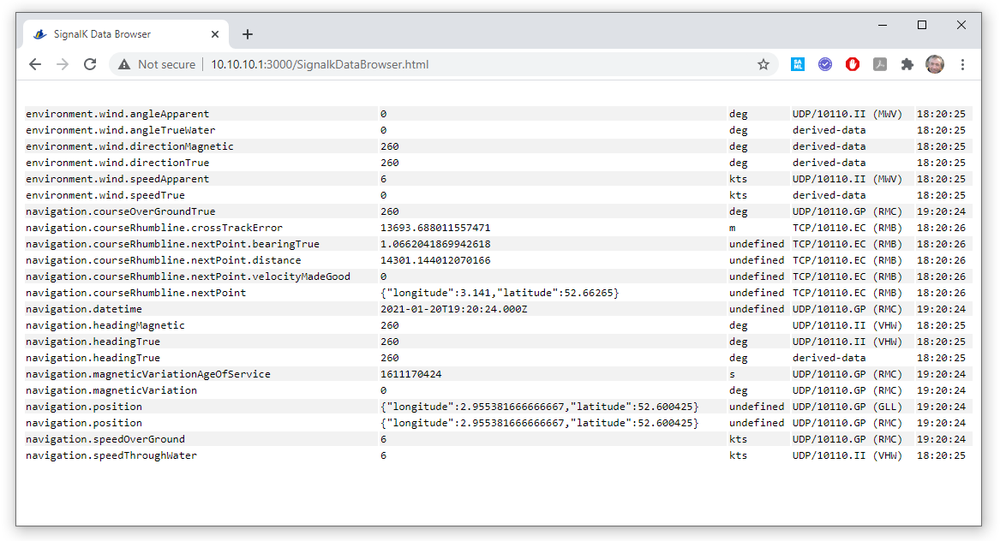
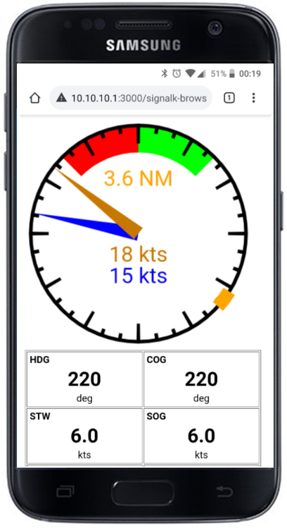
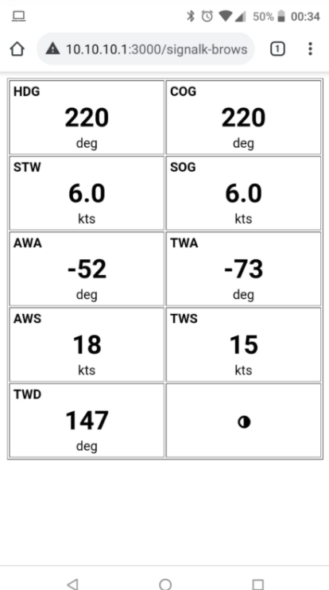

# SignalkDataBrowser

One-file, html and javascript based tool that presents the 'self' data from a local SignalK engine. It converts units to nautical units, and it updates automatically.

Usage
- In the file SignalkDataBrowser.html, adjust the variable mySignalkURL to reflect the IP of your SignalK server. The default is right for a typical Openplotter installation.
```
//
// Configure your signalk url:port below, like openplotter.myboat.local:3000 or 10.10.10.1:3000
//
var mySignalkURL = "10.10.10.1:3000"

```

Then, open the file in your browser. You can also copy it to the public directory in the SignalK directory tree (e.g., /usr/lib/node_modules/signalk-server/public/SignalkDataBrowser.html to make it available on http. See example below.



With ?presentation=display, it shows a selection of values in a way that does well on mobile devices:



With ?presentation=gauge, it shows a wind gauge with apparent and true wind, if available. Also, it features an aviation-syle 'heading bug', that points to the next waypoint, and distance, if an active route is provided:



By default, a 5 second timeout governs data items to be marked 'stale', striking the values out in the list, or not showing then in the gauge.
